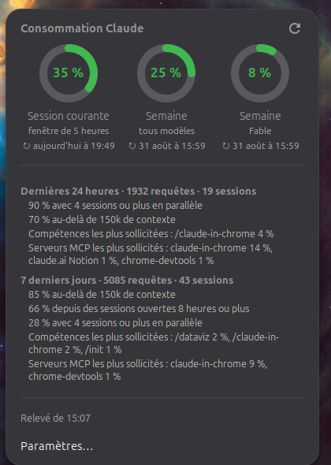

# Claude Usage

*[English version](README.md)* · [extensions.gnome.org](https://extensions.gnome.org/extension/10785/claude-usage/)

Un indicateur GNOME Shell pour votre consommation **Claude Code** : un camembert
dans la barre supérieure pour la fenêtre de cinq heures en cours, et le détail au
clic — les limites hebdomadaires, l'heure de leur remise à zéro, et ce qui pèse
dans la consommation.




## D'où viennent les chiffres

De `claude -p "/usage"` — la commande que vous pouvez taper dans une session. Ce
sont donc les chiffres officiels de votre compte, pas une estimation reconstituée
à partir des journaux locaux.

Ce choix a des conséquences qu'il vaut mieux connaître :

- **Aucune clé d'API, aucun jeton dépensé.** L'extension ne lit jamais
  `~/.claude/.credentials.json` et ne parle jamais à Anthropic directement ; le
  CLI s'en charge, avec la session que vous avez déjà.
- **Un relevé prend environ cinq secondes**, d'où un rafraîchissement espacé
  (cinq minutes par défaut) et strictement asynchrone : rien ici ne bloque le
  shell.
- **Il faut le CLI `claude` installé** et connecté. À défaut, le menu le dit
  plutôt que d'afficher un chiffre faux.

Le CLI répond en anglais quelle que soit la locale : l'extension analyse
l'anglais et le restitue dans votre langue. Une phrase qu'elle ne reconnaît pas
est affichée telle quelle plutôt que déformée — ce vocabulaire n'est pas une
interface documentée et peut changer.

## Installation

Sur [extensions.gnome.org](https://extensions.gnome.org/extension/10785/claude-usage/) — l'installation en un clic, une
fois la fiche relue (elle reste *Unreviewed* tant qu'un relecteur GNOME n'y est
pas passé, et le site la marque incompatible d'ici là).

Depuis les sources, ce qui marche dès maintenant :

```bash
git clone https://github.com/SalvadorCardona/gnome-claude-usage.git
cd gnome-claude-usage
./install.sh
gnome-extensions enable claude-usage@salvadorcardona.github.io
```

Puis **déconnectez-vous et reconnectez-vous** : GNOME Shell ne découvre une
extension nouvellement posée qu'au démarrage, et sous Wayland il ne peut pas être
relancé sur place.

`install.sh` pose un lien par fichier dans
`~/.local/share/gnome-shell/extensions/` : modifier le clone suffit à modifier
l'extension installée.

## Réglages

| Réglage | Défaut | Effet |
| --- | --- | --- |
| Limite affichée | Session courante | Laquelle des trois limites le camembert représente — ou la plus consommée. |
| Afficher le pourcentage | activé | Le chiffre à côté du camembert. |
| Intervalle de rafraîchissement | 300 s | Entre deux relevés. Le menu se rafraîchit aussi à l'ouverture si le dernier relevé a plus d'une minute. |
| Chemin du binaire claude | auto | `PATH`, puis `~/.local/bin/claude`, puis `~/.claude/local/claude`. |

## Traduire

`po/fr.po` est le catalogue français ; copiez-le dans votre langue et compilez :

```bash
python3 tools/po2mo.py po/xx.po locale/xx/LC_MESSAGES/claude-usage.mo
```

`tools/po2mo.py` existe parce que `msgfmt` n'est pas installé sur un Ubuntu par
défaut ; utilisez `msgfmt` si vous l'avez.

## Empaqueter

```bash
./pack.sh          # dist/claude-usage@salvadorcardona.github.io.shell-extension.zip
```

## Organisation

```
extension.js   l'indicateur : camembert de barre, menu, boucle de rafraîchissement
usage.js       lance le CLI et analyse sa réponse — aucun texte d'interface
format.js      met l'anglais du CLI dans la langue de l'utilisateur ; sans import GNOME, donc éprouvable
pie.js         l'anneau, dessiné au Cairo
prefs.js       la fenêtre de réglages
po/, tools/    traductions et compilateur .po → .mo
```

`format.js` reçoit son traducteur en argument au lieu d'importer gettext. C'est
ce qui permet d'éprouver ses règles hors du shell, où les modules
`resource:///` n'existent pas.

## Crédits

L'icône a été générée avec Gemini 2.5 Flash Image de Google (« nano banana ») via
OpenRouter, puis retournée en miroir pour que l'arc tourne dans le sens horaire,
comme la jauge de l'extension.

## Licence

GPL-2.0-or-later. Sans affiliation avec Anthropic.
