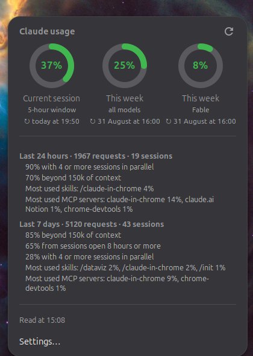

# Claude Usage

*[Version française](README.fr.md)* · [The site](https://cardona.digital/gnome-claude-usage/) · [extensions.gnome.org](https://extensions.gnome.org/extension/10785/claude-usage/)

A GNOME Shell indicator for your **Claude Code** usage: a pie in the top bar for
the current five-hour window, and the full picture on click — the weekly limits,
when each one resets, and what is driving your consumption.




## Where the figures come from

From `claude -p "/usage"` — the same command you can type in a session, so the
numbers are the official ones for your account, not an estimate reconstructed
from local logs.

That choice has consequences worth knowing:

- **No API key, no token spent.** The extension never reads
  `~/.claude/.credentials.json` and never talks to Anthropic directly; the CLI
  does, with the session you already have.
- **A reading takes about five seconds**, which is why it is spaced out (five
  minutes by default) and strictly asynchronous — nothing here ever blocks the
  shell.
- **It needs the `claude` CLI installed** and signed in. Without it, the menu
  says so rather than showing a wrong number.

The CLI answers in English whatever your locale, so the extension parses English
and re-renders it in yours. A sentence it does not recognise is shown as it came
rather than mangled — the wording is not a documented interface and may change.

## Install

On [extensions.gnome.org](https://extensions.gnome.org/extension/10785/claude-usage/) — the one-click route, once the
listing clears review (it is *Unreviewed* until a GNOME reviewer has looked at
it, and the site marks it incompatible until then).

From source, which works right now:

```bash
git clone https://github.com/SalvadorCardona/gnome-claude-usage.git
cd gnome-claude-usage
./install.sh
gnome-extensions enable claude-usage@salvadorcardona.github.io
```

Then **log out and back in**: GNOME Shell only picks up a newly added extension
at startup, and on Wayland it cannot be restarted in place.

`install.sh` symlinks each file into `~/.local/share/gnome-shell/extensions/`,
so editing the clone is enough to change the installed extension.

## Settings

| Setting | Default | What it does |
| --- | --- | --- |
| Limit shown | Current session | Which of the three limits the top bar pie stands for — or whichever is highest. |
| Show the percentage | on | The figure next to the pie. |
| Refresh interval | 300 s | Between two readings. The menu also refreshes when opened if the last reading is over a minute old. |
| Path to the claude binary | auto | `PATH`, then `~/.local/bin/claude`, then `~/.claude/local/claude`. |

## Translating

`po/fr.po` is the French catalogue; copy it to your language and compile:

```bash
python3 tools/po2mo.py po/xx.po locale/xx/LC_MESSAGES/claude-usage.mo
```

`tools/po2mo.py` is there because `msgfmt` is not installed on a default Ubuntu;
use `msgfmt` instead if you have it.

## Packaging

```bash
./pack.sh          # dist/claude-usage@salvadorcardona.github.io.shell-extension.zip
```

## Layout

```
extension.js   the indicator: panel pie, menu, refresh loop
usage.js       runs the CLI and parses its answer — no interface text
format.js      turns the CLI's English into the user's language; no GNOME import, so it is testable
pie.js         the ring, drawn with Cairo
prefs.js       the settings window
po/, tools/    translations and the .po → .mo compiler
```

`format.js` takes its translator as an argument instead of importing gettext.
That is what lets its rules be exercised outside the shell, where
`resource:///` modules do not exist.

## Credits

The icon was generated with Google's Gemini 2.5 Flash Image (“nano banana”) via
OpenRouter, then mirrored so the arc sweeps clockwise like the gauge in the
extension itself.

## Author

Written and maintained by Salvador Cardona, web developer —
[site de Salvador Cardona](https://cardona.digital). The extension has a page of
its own at [cardona.digital/gnome-claude-usage](https://cardona.digital/gnome-claude-usage/),
and the source lives on
[GitHub](https://github.com/SalvadorCardona/gnome-claude-usage).

## Licence

GPL-2.0-or-later. Not affiliated with Anthropic.
